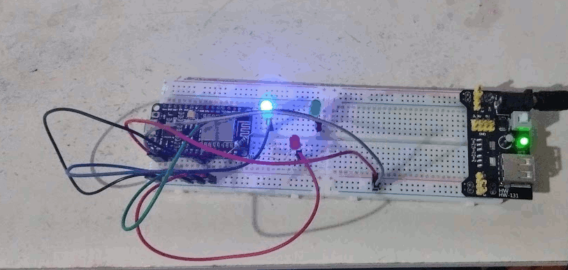

# Device Controled Presumably With Mind

**Tryed the experiment from the documentary "[Close Encounters of the Fifth Kind](https://www.youtube.com/watch?v=CRK6IA--Swk)" using the following code: [randomizer_test.ino](randomizer_test.ino) and a NodeMCU board ( should work with any arduino )**

### Hypotesis :
  - you control reality outcome with your mind
### Setup :
  - A random generator make one of 3 LED (RGB) light up
### Expected result :
  - You can force a color by thinking about it
### Result :
  - Reality dosn't seam to work this way ( maybe it's not the same setup as the documentary )*
### What's next ?
  - Trying again with a geiger counter and a radioactive material in a faraday cage 
